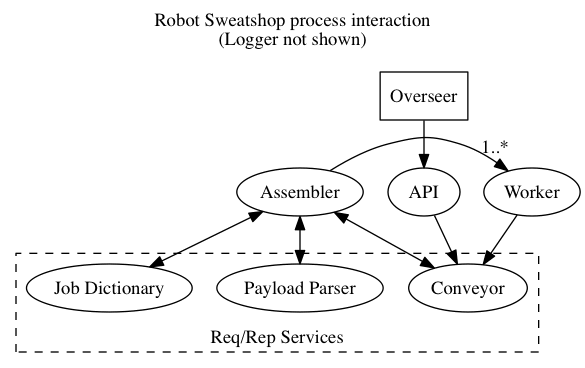

# Process Architecture



# Message Data Schema

## overseer

```
POST payload /run/:job
```

## input

```
PUSH {
  payload Hash
  user_agent String
  job_name String
}
```

## conveyor

```
REQ {
  method String
  data String
}
```

method | parameters | reply
-------|------------|-------
enqueue|item        |id Fixnum
dequeue|-           |id Fixnum
lookup |id          |item Hash
finish |id          |true Bool

## payload-parser

```
REQ {
  payload String
  user_agent String
}

REP {
  payload Hash
}
```

## job-dictionary

```
REQ {
  job_name String
}

REP {
  definition Hash
}
```

## assembler

```
PUSH {
  context Hash
  commands Array
  job_name String
  job_id Fixnum
}
```

# Notes

Context is passed around with string keys because it's user provided. Everything else is passed with symbol keys
